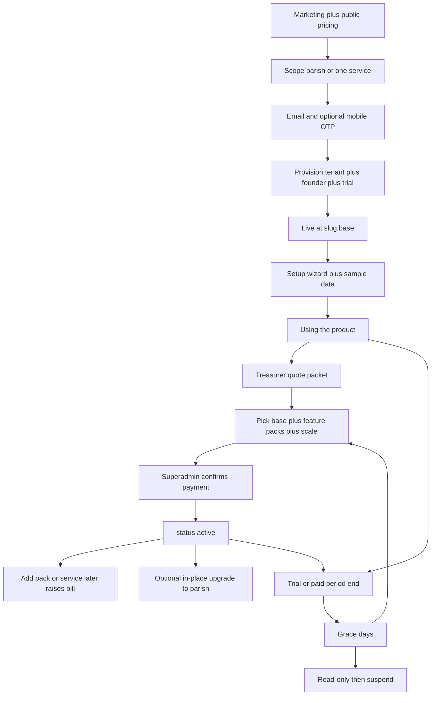
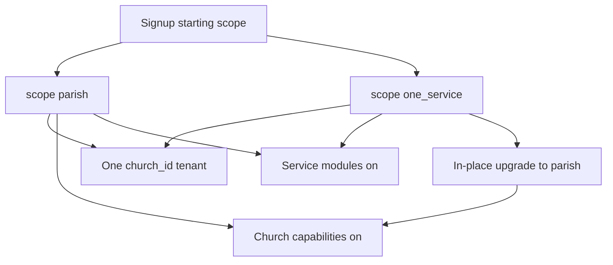
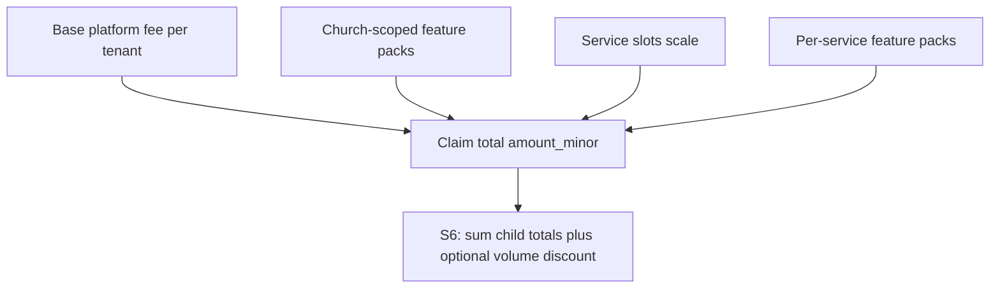
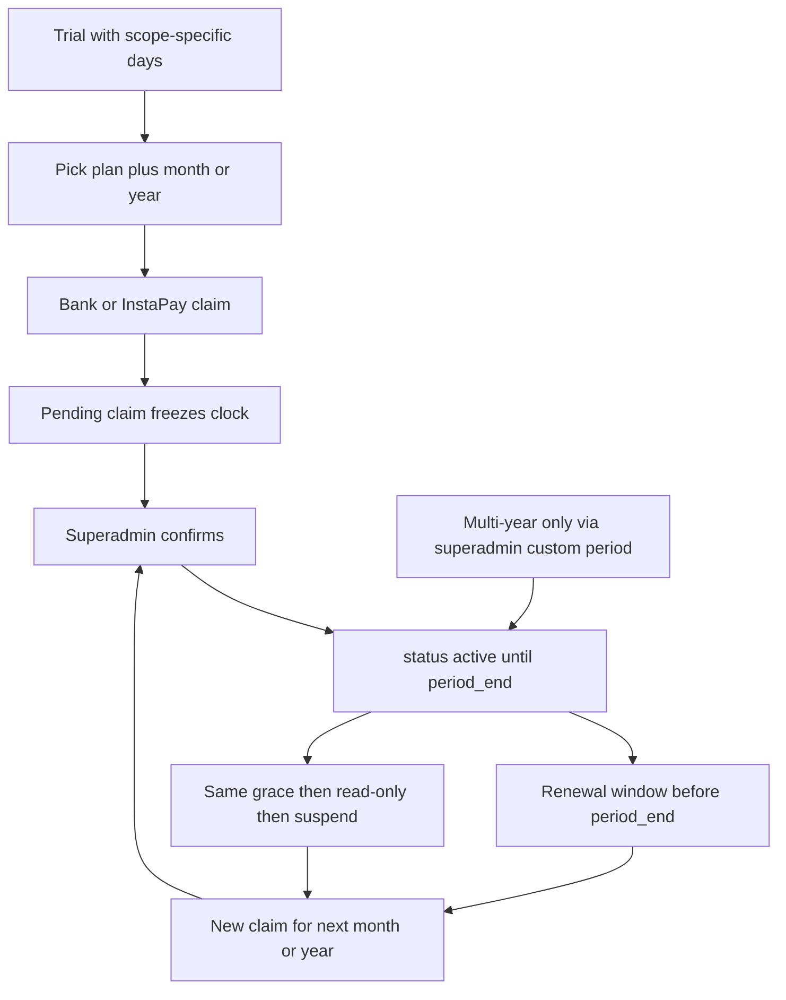
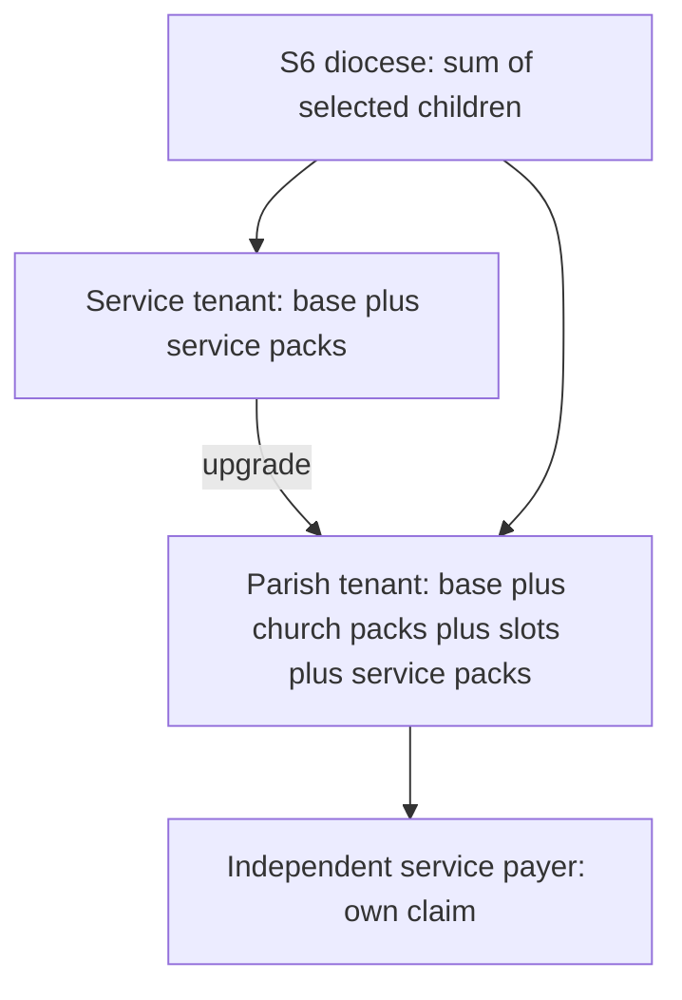
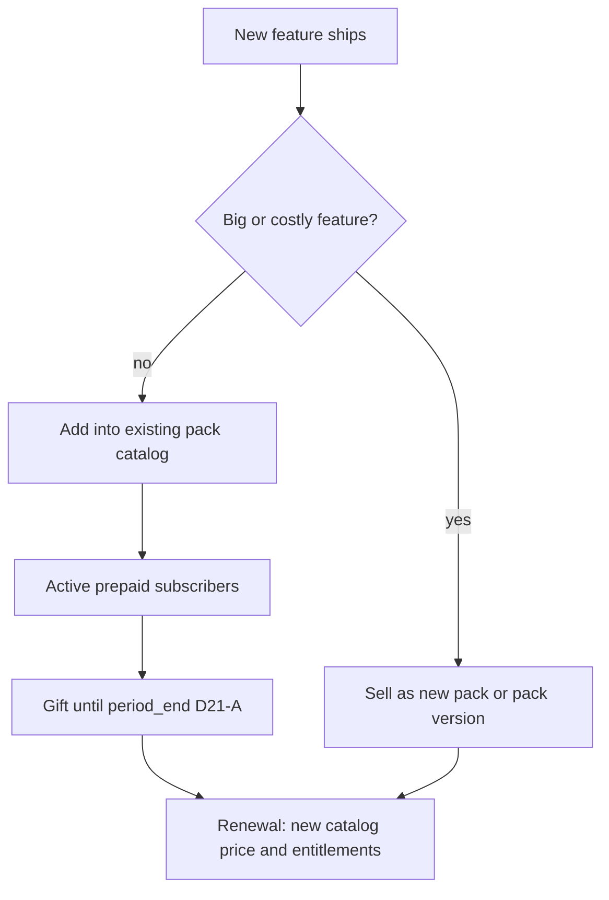

# Church self-serve: trial → subdomain → pay → live service

**Status:** S1 (instant trial provision) is in implementation on `feat/church-self-serve-s1`. Later waves (wizard, pricing, claims, gateways) stay parked. Flag `SELF_SERVE_CHURCH_SIGNUP` defaults **off**.  
**Roadmap:** later T11-style epic. Reverses master-plan §17.4 (approval no longer the provision gate).  
**Feature-gap:** **F-22**.  
**Source plan:** `.cursor/plans/church_self-serve_onboarding_e9cc9a3e.plan.md`  
**Parking entry:** add to root [`PARKING-LOT.md`](../PARKING-LOT.md) when this epic is un-parked.

**Overview:** Instant trial tenant (parish or one-service scope), guided setup, prepaid terms via bank/InstaPay with superadmin payment-confirm, then Paymob/Fawry later. One tenant forever. **Commercial model: modular feature packs + scale** (more services / more church packs / more diocese children ⇒ higher bill). Term discount = **1 month off per year of cover** (pro-rata; max term **2 years**). One claim per payer with line items. No lifetime license. Catalog must match the story before `/pricing` goes live.

---

## What already exists (do not rebuild)

The funnel is **mostly assembled as superadmin-only pieces**. This epic wires them into a public path and adds the missing trial clock + payment-claim step.

- Public lead form [`/register-church`](../app/Http/Controllers/ChurchRegistrationController.php) → `church_applications` (email verify, **no church created**).
- [`ChurchProvisioningService::create()`](../app/Services/ChurchProvisioningService.php) already creates church + org + capabilities + cloned roles + first admins + `audit_log`. Default today: **all** capabilities — trial must pass an explicit subset.
- Subdomain is `{slug}.{TENANCY_BASE_DOMAIN}` via [`ChurchHost`](../app/Support/ChurchHost.php). Live only when `MULTI_TENANT=true` **and** wildcard DNS/TLS exist.
- Billing catalog + entitlements are real ([`ChurchSubscriptionService`](../app/Billing/ChurchSubscriptionService.php), seeded `pilot` / `starter` / `pro` / `enterprise`). Status `trialing` and `plan_price.trial_days` exist; **nothing expires them**. `grace_days` is already in [`config/billing.php`](../config/billing.php). All seeded `trial_days = 0`; `assignPlan` ignores the column.
- `organizations.onboarding_state` is written as `{phase: provisioned, completed: false}` and **never consumed**.
- Invite-by-email / OTP claim already works for later staff ([`ChurchMemberInviteService`](../app/Services/ChurchMemberInviteService.php)).
- `user.registration_lane` is a nullable string (`open_self_serve` / `qr_token` / `invite`) — adding `church_founder` is easy; [`RequireApprovedApplication`](../app/Http/Middleware/RequireApprovedApplication.php) must treat that lane as approved.
- Reserved slugs (`admin`, `www`, …) are **design-only** today — [`ChurchSlugSuggester`](../app/Services/ChurchSlugSuggester.php) checks uniqueness only.

**Phase rule:** this is **ahead of** current master-plan work (post-T10c staging sign-off, production still `MULTI_TENANT=false`). Per rule 10, implementation waits until staging cutover is real. It **reverses** master-plan §17.4 (“approval does not auto-provision”).

**Product decisions (locked — do not reopen):**

- Instant trial after contact verify. Superadmin is notified, not a gate.
- First paid path: **bank transfer or InstaPay** + **superadmin confirms the payment**. Paymob / Fawry **parked until S5**. S4 safety: Optimistic Unsuspend (48h), quote-driven grace, pending-claim freeze.
- Self-serve paid terms: **1 month | 6 months | 1 year | 2 years** (cap). **Term discount:** one free month of value per year of cover, pro-rata (`discount_months = term_months / 12`, so 6 mo → ½ month, 12 → 1, 24 → 2). Money = integer floor on `amount_minor`. No term longer than 2 years in self-serve.
- **One tenant, starting scope** (parish-wide vs one service). Church-wide vs service-specific features stay capability-gated on the same `church_id`. A service can start without the parish; they can later **upgrade in place** to a parish account. No second isolation model. No merge required for that upgrade.
- **Bill the payer, not the org chart.** One prepaid claim (or later one gateway checkout) per paying account. Receipt shows **line items**. Not a lifetime “pay once for the whole church.” Not mandatory separate bank transfers for church + each service + diocese.
- **Commercial model:** **base + feature packs + scale**. Church and/or service subscribe to packs; adding packs or services raises the fee. Diocese bill scales with how many child tenants (and their packs) it covers. No per-student meter, no forever-free public Pilot, no per-seat overage meter in S4 (seat **bands** on base only).
- **Trial packs (D7-B):** Service trial = Core + Assessment; Parish trial = Core + Assessment + Parish Ops. **Gamified Service trial (D11):** 7 days +7 on wizard complete.
- **Scholarship / pilot comps (D9):** some churches or services may get **full scholarship** (100% comp) as piloting/test tenants — named, time-boxed or reviewed, audited `comp_reason`; not informal forever friends-and-family.
- **Catalog change policy:** never raise price mid-prepaid-period; snapshot what they bought; small features gifted until renewal (**D21-A**). Mid-term **add-ons co-term prorated (D10)**. See **Pack evolution** + amendment.
- **Continuity (D22–D28):** base lapse protection; quote-driven grace; optimistic unsuspend; Redis provision locks; ownership handover; Official Parish badge; ROI pitch PDF; Fawry/Paymob S5-only.
- **S4 extras in scope:** public `/pricing` (live catalog + pack matrix), church-scoped sample data, receipt with line items, treasurer quote packet, superadmin new-tenant filters, claim `payer_kind` / `payer_name`, payment-exception rules, identity badge before public publish, export while read-only.
- **Diocese later:** a **workspace** (console host, attach children, pooled pay that **sums child bills** with optional volume discount, later read-only oversight). Child `church_id` isolation stays sacred. Not a shared mega-tenant.
- **VAT:** receipts are the default. Official 14% invoices are a flag after you are registered — do not block S4/S5.



---

## One tenant, two starting scopes (church features vs service features)

The product already has both layers on **one** `church_id`. That is the answer to “we have church-wide features and service-specific features” — it is not a reason to pick church-first *or* service-first as the only door.

| Layer | Examples already in the app | Gate |
|---|---|---|
| Church-wide | priests / confession, home visits, payroll, public parish CMS, church cycle dashboard, church members | capabilities such as `church_management`, `public_site` |
| Service-specific | curriculum, attendance, exams, grades, structure templates, end-of-cycle | a `service` row + service/course permissions |

A service row **cannot** exist without a tenant. Isolation is `church_id`. Billing’s [`independent_payer`](../app/Billing/ServiceSubscriptionService.php) only means “this department pays an add-on **inside an already enrolled parish**.” It does not help a khidma whose parish will not sign up.

### Recommendation (locked)

**Church-first as the default story. Service-led as a first-class starting scope. Same tenant forever.**

Do not split the platform into “a church product” and “a service product.” Do not make `Service` a second isolation boundary. Do not dump orphans into a shared holding church.

Signup asks: **are you opening a parish account, or one service?** Both create the same kind of tenant (`ChurchProvisioningService`). The difference is **which capabilities are on** and **how many services they may create**.

- **Start as parish:** `place_key` uniqueness, many services, church-management available on the trial/paid plan, official public site allowed when they publish (after identity soft-gate).
- **Start as one service:** one `service` created at provision (`max_services=1`), church-management **off**, public site is a service page (must not claim to be the official parish). Optional `meets_at` label is not a church row.



**Upgrade is in-place, not a merge.** When the parish becomes willing (or they want confession/payroll/official homepage), the founder fills parish identity + `place_key` and you turn on church capabilities / raise `max_services`. Same subdomain, same people, same courses. No `church_id` rewrite.

That is better than “church must exist first” (you lose every khidma whose board will not enroll) and better than “service is its own tenant type” (church features would have nowhere to live, and upgrade would be a data migration).

### Real cases

- **Parish wants the whole platform:** start as parish. Church-first.
- **Parish will not enroll; one khidma will:** start as one service. No church approval. They only see service features.
- **Parish already pays another vendor for church-wide tools:** start as one service. They keep the other vendor for confession/finance; they use us for servants-prep (or whatever). No parish record required.
- **Parish is already on Khedma; one department pays extra:** existing `independent_payer` add-on. Not a second tenant.
- **Same parish later wants the church modules on this account:** in-place upgrade. Preferred.
- **A different person later opens a real parish tenant while a service tenant already exists:** do **not** auto-merge (two buyers, two bills). Soft `meets_at` label only. Superadmin absorb stays parked.

### Product shape when they start as one service

- Trial/paid floor like a **Service** SKU (not public `pilot`): 1 service, no `custom_domain`, `church_management` off (nav already 404s on disabled capabilities).
- Founder is `church-admin` of that tenant — they are the service admin. Parish-only screens stay hidden until upgrade.
- Abuse: they must not take another parish’s `place_key`. Soft identity gate before publish. Suspend still works. You get a create notification, same as the parish lane.

---

## Catalog and commercial rules (must land before public `/pricing`)

Reality the catalog must price for:

- Dioceses have **different numbers of churches**.
- Churches have **different numbers of services**.
- A **church** and a **service** can each subscribe to **different feature sets**.
- **Adding features (or services) must raise the fee.**

Rigid “Starter / Pro / Enterprise includes everything in the tier” fights that. The product already has the right primitives: church floor entitlements + per-service add-ons ([`EntitlementMerger`](../app/Billing/EntitlementMerger.php), [`ServiceSubscription`](../app/Models/ServiceSubscription.php), `independent_payer`). What is missing is **pricing those as additive line items**.

### What is wrong today

| Need | Seeded catalog |
|---|---|
| Modular features that raise price | Monolithic tiers; Starter→Pro is the only self-serve path to `church_management` / exams |
| Service vs church feature scope | `service-addon` is one exams blob, not a pack catalog; no public Service door |
| Scale with #services | Only coarse `max_services` on a tier |
| Scale with #churches (diocese) | Not modeled; S6 must **sum child bills**, not one flat diocese SKU |
| Trial / public honesty | `pilot` is 0 EGP and public; `trial_days` unused |

### Rejected models (locked)

- Per-student / per-attendance metering.
- Lifetime / pay-once church license.
- **Separate bank transfer per pack** (treasurer hell). One claim; many line items.
- Forever-free public Pilot on `/pricing`.
- Per-seat overage *meters* in S4 (seat **bands** on base only).
- Pure freemium forever on Service.
- **One flat diocese price** that ignores how many churches / what they run (unfair to small dioceses; undercharges large ones).

### Accepted model (shape locked; packs + amounts open)

**Base + feature packs + scale. Prepaid. Year preferred / month secondary. One claim per payer with line items.**



#### 1. Base (always)

| Base | Who | Includes | Does not include |
|---|---|---|---|
| **Service base** | `account_kind=one_service` | Host, small seat band, 1 service slot, people/roles | Paid feature packs (unless trial grants Core — open) |
| **Parish base** | `account_kind=parish` | Host, larger seat band, N included service **slots** (capacity, not free packs on every slot) | Church packs; per-service packs |

Base alone must not unlock every module. **Capabilities come from packs.**

#### 2. Feature packs (the price driver)

Sell **packs** (small bundles of entitlement keys), not 15 independent capability toggles on checkout. Packs map onto existing `maps_to_capability` keys.

**Proposed pack catalog (final list open — see D2):**

| Pack | Scope | Example entitlements | When fee rises |
|---|---|---|---|
| **Core Khidma** | service (or church floor covering services) | curriculum, attendance, assignments, announcements | A service needs the basics |
| **Assessment** | service | exams, grades, assessments, live_quiz, feedback | A service turns on exams/grades |
| **Parish Ops** | church | church_management, public_site | Confession/visits/payroll/official site |
| **Engagement** | church or service | events, reporting (split open) | Events/reporting wanted |
| **Platform** | church | custom_domain, richer `mobile_app`, api_access | Branding / API / full mobile |

Rules:

- Turning a pack **on** adds its `amount_minor` to the next claim (and renewals).
- Turning a pack **off** only at `period_end` — no mid-term refund in S4.
- Church-scoped packs → church entitlement floor.
- Service-scoped packs → `ServiceSubscription` + `EntitlementMerger`.
- Department pays itself: `independent_payer=true` — **their** claim covers that service’s packs.
- Same payer: **one claim** totaling base + packs + scale (never N bank transfers for N packs).

#### 3. Scale (why bills differ)

| Dimension | How it raises the fee |
|---|---|
| **More services in one church** | Slots beyond included capacity cost a **slot fee**, and/or each service carries its own packs. 8 services > 1 service on the same packs. |
| **More packs on one service** | Core only ≪ Core + Assessment. |
| **More church packs** | Service-only tenant has no Parish Ops; full parish adds it. |
| **More churches under a diocese** | S6: **sum of each child’s modular bill**. Optional volume discount by child count. A 5-church diocese must not pay as if it had 40; a 40-church diocese must pay more than 5. |

Seat bands stay on **base** (servants/staff, not children). Not a per-head meter in S4.

#### 4. Signup doors (isolation unchanged)

- **Start as one service:** Service base + service packs (trial may unlock Core). No Parish Ops until in-place upgrade.
- **Start as parish:** Parish base + optional Parish Ops (+ other church packs) + included slots; each service gets packs (floor and/or per-service).

**Recommended bundles on `/pricing`** (named carts — not a second contradictory catalog):

- “خدمة واحدة” = Service base + Core.
- “كنيسة أساسية” = Parish base + Parish Ops + Core on included slots.
- “كنيسة + تقييم” = above + Assessment on N services.

Bundle CTA pre-fills packs; in-tenant billing still allows custom pack selection.

#### 5. Trial overlay

- `pilot` → `is_public=false`.
- Trial grants a **defined pack set** (open: Core only vs Core + Parish Ops for parish) for `trial_days`, not all capabilities.
- Paid convert: choose packs; claim total = sum(line items).

#### 6. Claim / receipt line items (S4)

Additive lines on `billing_payment_claim` (rows or JSON):

- `base` · `pack:{slug}` · `service_slot` · `service_pack:{slug}:{service_id}`
- Each: `amount_minor`, interval, label ar/en
- Header `amount_minor` = integer sum(lines); reject mismatch

Treasurer packet and receipt print the same lines. Diocese S6 receipt = header + per-child subtotals + optional discount line.

- **Checkout default:** prefer **1 year** (with D8 discount); also offer 1 month / 6 months / 2 years. Seat copy = servants not children. Do not print unenforced quotas as hard limits.

**Tenant Zero fairness:** FAQ + written comp policy before public launch.

#### 7. Catalog pass (before `/pricing` public)

1. Hide `pilot` from public.
2. Model **bases** + **packs** (reuse `subscription_plan` with `kind=base|pack` metadata, or additive pack tables — open D1).
3. Add `public_site` entitlement key.
4. Bundle cards on `/pricing` must equal real pack sums.
5. Fix `trial_days` + entitlement sync when attaching packs.
6. Name year discount; review all `amount_minor`.

---

## Lifecycle (happy path)

### 1. Start — public founder signup

Replace “lead then wait” with a **founder signup** (extend `/register-church`, do not invent a second form). First field: **starting scope** (parish vs one service).

**Parish lane** collects:

- Church `name`, `short_name`, place fields (reuse `place_key` uniqueness)
- Requested slug (reuse existing slug suggester + **reserved list**)
- Contact name, email, mobile
- Optional: intended first service type — stored only, not required to provision

**One-service lane** collects:

- Service name (this becomes tenant `name` / public title)
- Structure template (required — the one service is created at provision)
- Optional host-parish label + area (not `place_key`, not unique)
- Requested slug, contact name, email, mobile

Also: Terms + privacy checkbox (include trial PII / WhatsApp reminder consent); feature flag so historical `pending_review` leads are not auto-provisioned.

Rules that keep you out of the loop:

- One **active trial** per contact email (and per mobile).
- One **active trial** per `place_key` (parish lane) so rotating emails cannot re-trial the same parish.
- Block disposable emails; rate-limit by IP.
- `place_key` still unique so two “كنيسة العذراء” in different districts are fine; same place is not.
- Superadmin gets a notification + queue row (`church.created` already audits). Suspend remains the abuse tool (`church.status = suspended` already 404s the host).
- No automatic second trial after suspend — only superadmin `comp` / short extension.

### 2. Verify — then create the human and the tenant together

On verify, one transaction (with a short-lived `provisioning` application status so double-click / retry cannot create two churches):

1. Create or attach the **founder `User`**: `registration_completed=true`, `application_status=approved`, `is_verified=true`, `registration_lane=church_founder` (bypasses servant `/register` review). Existing global users just get membership — shared user pool. Next web login needs a **tenant picker / switcher** if they already belong to Tenant Zero (mobile picker stays later).
2. Call `ChurchProvisioningService::create()` with that user as the only `admin_user_id`, starting scope, and capabilities from the **trial overlay** (parish: church-capable trial; one-service: 1-service floor, church-management off) — **never** the full capabilities dump. One-service lane also creates the first `service` in the same transaction.
3. `ChurchSubscriptionService::assignPlan(..., status: trialing)` with `current_period_end = now + trial_days` (required fix: today `assignPlan` ignores `trial_days` and always sets month/year).
4. Link `church_applications.church_id` (additive column). Status becomes `provisioned` (new status) instead of sitting in `pending_review`.
5. Redirect to `{slug}.{base}` (signed first-login if password not set yet — reuse invitation OTP / set-password). Staging must prove `SESSION_DOMAIN` / TrustHosts accept the new slug before S1 is done.

**Prerequisite you cannot skip:** production/staging `MULTI_TENANT=true` + wildcard DNS/TLS. Until then a new church row is invisible; all traffic still binds Tenant Zero.

### 3. Trial tenant — subdomain is the product

Day-0 church is empty on purpose (Tenant Zero data never copies). Entitlements come from the trial overlay (not a public 0 EGP plan). Quotas already enforced in invite + service-create + custom domain.

Recommended trial lengths (see open decisions):

- **Service:** 14 days (enough for a servant to try attendance).
- **Parish:** 30 days preferred (committee vote needs more than 14). Same machine, different `trial_days`.

`church.status = active`, subscription `trialing`. Public homepage stays unpublished until they finish T10c publish **and** pass the soft identity gate — they are not “on the internet” as a fake parish by default.

### 4. Guided setup — consume `onboarding_state` (closes F-11 for this persona)

A church-admin-only wizard on the tenant host. Checklist, skippable, persisted on `organizations.onboarding_state`:

1. Confirm identity / timezone / locale (settings JSON).
2. Create **first service** + pick a structure template (`educational_standard` / `meeting_flat` / `care_sector`) — skip if the one-service lane already created it at provision.
3. Invite 1–3 people (priest / secretary / servants) via existing invite — **including at least one billing contact** (`church.billing.manage`) when the founder is not the treasurer.
4. Optional branding (T10b already exists).
5. **Sample data** — default-on toggle with one-click wipe (biggest activation lever; see First-ship extras).

Until `completed=true`, show a persistent banner. Do not block the rest of the app. Trial banner also shows the single WhatsApp/email support target (sales/support, not only the wizard footer).

### 5. Subscription choice — still self-serve

In-tenant **Billing** page (new permission `church.billing.manage`, church-admin only):

- Show trial countdown, current entitlements, **active packs**, service count vs included slots.
- Pick **base + packs** (or a named bundle) + term (**1 month | 6 months | 1 year | 2 years**; default 1 year). Live total = sum of line items minus **D8 term discount** (**integer minor units + EGP**).
- Adding a pack or a service slot **raises** the next claim total; mid-term adds are **co-termed** (prorated to existing `period_end`).
- Show platform **bank account + InstaPay handle** from config/settings (not hardcoded in views).
- **Treasurer packet** + **ROI pitch PDF** (“Why …?” — brand Q8): print/PDF + WhatsApp share (**line items**, total, bank/InstaPay, period, payer field, quote valid-until).

No card form in this wave. Because first-wave money is bank/InstaPay, every paid term is **prepaid** — there is no card on file and **no silent auto-renew**.

### 6. Pay — proof in, you confirm once

New additive `billing_payment_claim` (or similar):

- Header: `church_id`, `amount_minor` (sum of lines), `currency`, `method` (`bank_transfer` | `instapay`), `payer_reference`, `proof_path`, `status` (`pending` | `confirmed` | `rejected`), timestamps, reviewer.
- **Lines:** base, church packs, service slots, per-service packs (see catalog). Interval from cart (`month` | `year`).

Church admin uploads screenshot + reference → status `pending` → you get a console queue (narrower than today’s “create the whole church”).

If they were `past_due` / `suspended` when submitting: **Optimistic Unsuspend** grants **48h** full access immediately (D24). On confirm: attach packs / sync entitlements + set subscription `active` with period math that **does not burn unused trial** (see Paid term), + `audit_log`, + receipt **with line items**. On reject: revert lock (reject wins over remaining 48h) with a **church-visible** reason. Confirm is **idempotent**.

**This is the only remaining superadmin touch** until S5 Paymob/Fawry.

Later S5: Paymob (cards/wallets) + Fawry replace the claim with a webhook → same confirm path. Keep a `BillingGateway` interface so the church UI does not change. Existing Stripe columns stay unused placeholders. Auto-charge on renewal is a **S5b** option; until then renewal is another prepaid claim.

### 7. Trial ends without payment

Scheduled command (daily), using existing statuses:

- During trial (`trialing`): full trial entitlements.
- **Pending claim freezes the clock:** if a claim is `pending` at `period_end`, keep current entitlements until confirm/reject + a freeze cap. **Quote-driven grace** may extend trial grace to quote `valid_until` (D23).
- **Optimistic Unsuspend:** claim while past_due/suspended → 48h write access (D24).
- After `period_end`, within `grace_days` (already 7), no pending claim: `grace` — full access + blocking banner + email/WhatsApp.
- After grace, claim pending beyond freeze cap: `past_due` — **read-only** (login + view + **export** + billing/proof; writes 403) unless inside optimistic 48h.
- After grace, no claim: `canceled` + `church.status=suspended` — host 404s **unless** base lapse protection keeps independent services alive in degraded mode (D22); data retained per retention policy.

Reminders at T-7 / T-3 / T-1 / grace-start to **every** user with `church.billing.manage` (not only the founder). Never-logged-in trials: skip reminder spam after N days; optional auto-suspend to cut cost (still no delete). Never delete tenant data automatically.

Read-only must cover **web, API, mobile, and scheduled jobs** (queues that would write attendance reminders / certificates must no-op). Export of people + attendance stays available so past_due is not hostage-taking.

### 8. In-place upgrade (one-service → parish)

A dedicated billing/settings action, not a second signup. Founder fills `place_key` + official name + official Facebook/website, accepts that the public site may become a parish site, completes **mandatory ownership handover** (`church-admin` + billing to official contact), picks Parish base + packs, files a claim (**co-term prorated** to current `period_end`). On confirm: turn on Parish Ops / raise slots, cancel Service base line, keep slug and members. Parish Ops stay locked until handover + confirm.

---

## Paid term and renewal (self-serve through 2 years)

Today the catalog only stores `plan_price.billing_interval` as `month | year` ([migration](../database/migrations/2026_08_16_000001_create_platform_billing_tables.php)). This epic makes the clock real and expands self-serve terms per **D8**.

**Decision (locked):** self-serve checkout offers **1 month | 6 months | 1 year | 2 years**. **Term discount:** `discount_months = term_months / 12` (½ / 1 / 2 months off respectively for 6m / 1y / 2y). No self-serve term beyond 2 years; odd longer cover = superadmin custom `period_end`.

**Trial is independent of the paid term.** They choose term length when they convert (or later renew). They do not “start a yearly trial.”

**Unused trial credit (locked shape):** converting mid-trial must not punish early payers. Prefer:

`period_end = max(old_trial_end, confirm_at) + paid_term`

or start the paid term at confirm and **add unused trial days**. This is date-math only — not the parked `credit_minor` ledger.



### What the church buys (self-serve)

- **One month:** catalog `billing_interval=month`. After confirm they are covered until confirm (or credited start) + 1 month. Next payment is another monthly transfer (new claim).
- **One year:** catalog `billing_interval=year`. After confirm they are covered until confirm (or credited start) + 1 year. Next payment is another yearly transfer.

`amount_minor` on the claim is copied from the chosen `plan_price` (and snapshotted for quote valid-until). No `term_count` in S4.

### Multi-year beyond 2 years (not self-serve)

Cover longer than 2 years is superadmin-only (`comped` / custom `current_period_end`). Self-serve stops at 2 years with D8’s 2-month discount.

### Renewal (same machine for month and year)

Because money is prepaid (bank / InstaPay):

1. While `now < current_period_end` and status is `active`: full paid entitlements. No extra confirm from you.
2. **Renewal window** before expiry (monthly: T-7; yearly: T-30 then T-7 / T-3 / T-1): billing page asks them to pay the **next** term. They may keep month/year or switch, or change plan.
3. They file a new claim. You confirm. `period_end` **extends from the existing `period_end`** if they paid before expiry (no lost days). If they paid after expiry, the new period starts at confirm time.
4. If they do nothing: the **same** grace → read-only → suspend path as a lapsed trial. Data is kept. Paying later unsuspends and starts a new period.

There is **no automatic monthly charge** in S4. “Subscribed for a month” means prepaid until that `period_end`. “Subscribed for a year” is the same idea with a later date.

### Mid-term changes (keep S4 simple — no money-proration ledger)

- **Upgrade** (Starter → Pro, or month → year) during a paid period: new claim for the **full new term** starting at confirm. Unused old days are not refunded in S4 (note it on the billing page). Superadmin can still `comp`. Trial→paid unused days **are** credited via date-math above.
- **Downgrade** or cancel: set `cancel_at_period_end` (column already exists). They keep current entitlements until `period_end`, then drop to the new plan or enter the lapse path. No mid-term refunds in S4.

### What `assignPlan` must grow

Honor `trial_days` when status is `trialing`. For paid confirm, keep today’s +1 month / +1 year from `plan_price.billing_interval`, apply unused-trial date credit, and **run the scheduled expiry job** so those dates actually do something. Superadmin custom `current_period_end` (multi-year exception) must not be overwritten by a blind `addYear()`.

---

## Who pays: church, service, diocese (under modular pricing)

Isolation is still one `church_id`. Money is who owns the [`BillingAccount`](../app/Models/BillingAccount.php) and which **line items** appear on their claim.

### Recommendation (locked principles)

1. **One claim per payer per period** — many line items, one transfer.
2. **Features raise the fee** — packs on church and/or service.
3. **Services raise the fee** — slots + per-service packs.
4. **Churches raise a diocese fee** — S6 sums children (optional volume discount). Not one flat diocese SKU.
5. **No lifetime license.**

### If only one service is subscribed

One tenant, one claim: Service base + that service’s packs. No Parish Ops. No diocese line unless the diocese is the `payer_kind` sending the transfer (label only in S4).

### If a parish runs many services

```
total = parish_base
      + church packs (e.g. Parish Ops)
      + max(0, service_count - included_slots) × slot_fee
      + Σ packs attached to each service
```

Example: Church A has 2 services on Core only; Church B has 6 services, two with Assessment, plus Parish Ops → **B’s bill is higher**. Same product, fair scale.

### Independent department

Service packs on that service; `independent_payer=true`; **their** claim. Church claim drops those lines. Entitlements still merge for that service only.

### In-place upgrade (service → parish)

Switch/raise base, enable Parish Ops (and other church packs) on the claim, raise included slots. Old Service base stops. S4: no money-proration ledger; unused days goodwill / `comp`. Same `church_id`.

### Diocese as payer (S4 label → S6 sum)

- **S4:** diocese can be `payer_kind` on a child claim (who sent InstaPay). Still one child’s line items.
- **S6:** diocese `BillingAccount` pays selected children in **one** claim: **sum of each child’s modular total**, optional discount by child count (open D5). Detach = child pays itself next term. Isolation unchanged.



### What about the old Starter/Pro rows?

Treat them as **optional preset bundles** (named carts of base+packs) for marketing and for churches that hate toggles — **or** retire them from public once packs ship. Do not keep a parallel universe where Pro is a monolith that contradicts pack prices (open D3).

---

## Operating rules (gaps closed on review)

These are **in scope when the epic is built**, not optional polish.

### Identity and hosts

- Signup lives on the apex / marketing host (extend `/register-church`), then redirect to `{slug}.{base}`. Do not collect the form on Tenant Zero’s app chrome.
- Reserve slugs: `admin`, `www`, `api`, `mail`, `app`, `staging`, plus `TENANCY_MAIN_SLUG`, plus a config list of famous/liturgical squatters you care about. Slug is Latin (existing suggester). Freeze slug after first successful login (superadmin can still rename).
- `SESSION_DOMAIN` / TrustHosts must accept new slugs immediately (wildcard). An AvaPachomius user who founds a second tenant keeps one `User` and gains a second `church_user` — they do not lose Tenant Zero membership; web login must offer a tenant switcher.
- `RequireApprovedApplication` must treat `registration_lane=church_founder` as approved. Verify-link is **idempotent** (second click resumes, does not double-provision). Application status `provisioning` is the lease during create.
- Existing `pending_review` church applications stay on the old queue until you flip a `SELF_SERVE_CHURCH_SIGNUP` flag; do not silently auto-provision historical leads.

### Starting scope storage

- Additive `church.account_kind` (`parish` | `one_service`) or `settings.account_kind`. Billing page shows **base + packs** appropriate to scope (Service base vs Parish base; Parish Ops only after parish / upgrade CTA).

### Soft identity gate (before public publish)

- One-service: publish requires an explicit “this is not the official parish page” acknowledgment; copy must not use parish-official wording.
- Parish: place fields complete; official Facebook/website **optional** at signup, **required** before **Official Parish** badge. **No** negative Unverified badge. Badge only after superadmin sets `settings.official_verified_at`.
- Homepage stays unpublished by default until T10c publish + gate.

### Read-only, export, and exams

- Implement `past_due` as middleware + API/mobile equivalents: block writes except billing/proof/logout/locale/**export**. Reads (grades, attendance history, published homepage) stay up so a mid-cycle class is not wiped.
- Scheduled jobs that would write must no-op under `past_due` / suspended.
- Suspend still 404s the host. `church_school_year` is **not** the billing period — do not couple them.
- Retention: state in Terms that suspended data is kept for a defined window (see open decisions), then `archived` + export offer — never silent delete in S4.

### Claims and money (exceptions)

- One pending claim per tenant. Header `amount_minor` must equal **sum of line items** (base + packs + slots); reject underpay. Store `payer_name` (founder / diocese / other) as a label only. Proof files live on the **platform** disk (they are not church CMS media): size cap, MIME allow-list, no executables. Payment instructions (bank + InstaPay) come from config and are snapshotted onto the claim so a later account-number change does not confuse an open transfer. Quote valid-until snapshots the **line items + total** the same way.
- **Confirm SLA:** target 1 business day. Pending claim freezes the clock (with a freeze cap).
- **Underpay:** reject; do not activate a shorter term. Church may file a second claim for the difference after reject (or pay full amount again — support decides; product does not invent partial terms).
- **Overpay:** activate full term; leftover is a support note / later `credit_minor` (parked). Do not invent a longer term in S4.
- **Duplicate proof / second upload:** while pending, replace proof on the same claim or wait until reject — do not open two pendings.
- **Wrong reference / personal InstaPay name:** matching guidance on the form (“الاسم على إنستاباي قد يكون شخصيًا”).
- **Reject reason** required and **visible to the church**.
- Confirm idempotent; unsuspend automatic on confirm if suspended for lapse.
- After confirm: simple **receipt** (ar/en, amount_minor, period dates, method, reference) — not a VAT invoice. Refunds are out of S4 (superadmin `comp` / note).
- If the confirm queue becomes the bottleneck, pull **Fawry reference** forward as S4.5 (no card) before full Paymob — see open decisions.

### Legal and trust

- Founder accepts Terms + privacy (localized) before provision. Collect no diocese papers and no national ID for v1. Terms cover trial student PII and WhatsApp reminders; repeat consent cue on first person-import / sample-data load.
- Public pricing page on the marketing host (Service vs Parish, month/year, what is included, seats = servants, Tenant Zero FAQ, annual discount named). Signup links from there.
- Written **comp policy** before public launch (who, how long, who approves).

### Ownership and support

- Founder is the first `church-admin`. Transfer billing owner in S4 = invite + grant `church.billing.manage` (documented happy path). Optional `settings.founded_by_user_id` for support.
- In-wizard help + a single WhatsApp/email support target on the trial banner. Sample data is labeled demo and is deletable.

### Activation (what “working” means)

- Count a trial as activated when they have: (1) first service, (2) at least one invited member who claimed, (3) one **non-sample** real write (session, person, or announcement). Sample writes may count toward a softer “engaged” funnel step, not `trial.activated`.
- Sample data default-on so day-0 is not a blank attendance grid.
- Funnel events (confirm names exist in W0–W6 or add them): `signup.started`, `tenant.provisioned`, `onboarding.step`, `trial.activated`, `claim.submitted`, `claim.confirmed`, `subscription.lapsed`.
- Seasonality note for ops (not code): khidma year ~September — prefer launch / annual renewal nudges around that cycle.

### What superadmin still does

- Notify + suspend fakes; confirm/reject claims; set `identity_verified_at`; custom `period_end` / `comp`; keep today’s manual church create for internals. Not in the happy-path provision.

---

## Additive schema (expand only)

- `church.account_kind` (or settings JSON) — `parish` | `one_service`.
- `church_applications.church_id` (nullable FK) + statuses `provisioning` / `provisioned`.
- `billing_payment_claim`: church_id, amount_minor (header sum), currency, method, payer_kind, payer_name, payer_reference, proof_path, instructions_snapshot(json), lines_snapshot(json) or child `billing_payment_claim_line` rows, quote_valid_until (nullable), status, reviewed_by, reject_reason, receipt_no / receipt_path, timestamps.
- Pack attachments: church and/or service subscription ↔ pack (additive table or plan rows with `kind=pack`) so renewals know what to re-sum.
- `user.registration_lane` value `church_founder` (string column — no enum migrate needed).
- Optional `church.settings.founded_by_user_id`, `meets_at` label for one-service, `identity_verified_at`.
- Entitlement catalog: add `public_site` key with `maps_to_capability`.
- Catalog: bases + packs; `pilot` not public; optional named **bundle** presets (carts) for `/pricing`.
- No drop of manual approve/create. No `term_count` in S4. No money-proration ledger in S4.

---

## Tests (required with the build)

- Tenancy isolation: new founder cannot read Tenant Zero; second tenant cannot read the first (`tests/Feature/Tenancy`).
- Provision idempotency; `provisioning` lease; reserved slug; `place_key` unique on parish only; one trial per email/mobile/`place_key`.
- Trial `period_end` uses `trial_days` (scope-specific lengths); paid confirm uses month/year + unused-trial date credit; expiry job → grace → read-only → suspend; pending claim freezes clock.
- Claim header must equal sum(lines); confirm attaches packs + receipt lines + unsuspend once; reject leaves status unchanged with visible reason.
- Adding Assessment (or a service slot) increases the next claim total vs base-only.
- Two churches with different service counts / packs produce different totals under the same price list.
- One-service tenant: `church_management` 404; `max_services=1`; upgrade path turns capabilities on.
- Soft identity gate blocks parish-official publish wording / requires acknowledgment.
- Read-only blocks web + API writes; export still allowed; jobs no-op.
- Quota: cannot create service 4 on Starter without add-on/upgrade.
- `SESSION_DOMAIN` / first-login on new subdomain (staging smoke).
- Locale key parity for every new string (ar/en).
- No new role-name checks.
- Catalog: `pilot` absent from `/pricing`; Service + Parish columns present; seats copy; year discount labeled.

---

## First-ship extras (ship with S4)

These are part of the first public funnel.

### Public pricing page

**Where:** marketing / apex host only (same place as `/register-church`). Not on Tenant Zero’s logged-in chrome, not on a church subdomain (that is their T10c site).

**Route:** `GET /pricing` (ar default + locale switch). CTAs: “ابدأ تجربة …” → `/register-church?scope=parish|one_service&bundle=…`. Query params pre-fill signup scope + intended **bundle** (cart of packs); they do not charge yet.

**Amounts (locked):** **live catalog.** Bundle card totals = **sum of pack/base line items** from the DB. Do not hardcode EGP in Blade. **Catalog pass must land first.**

Why not the alternatives:

- **“Starting from” + contact** puts you back in the happy path and hides the number that matters after trial.
- **Modules only, no amounts** — boards bounce.
- **Monolith tiers that ignore #services / packs** — unfair to small churches and undercharges large ones.

UX by persona:

- **Service founder:** bundle “خدمة واحدة” (Service base + Core) with year primary; footnote “أضف باقة التقييم لاحقاً”.
- **Parish founder / treasurer:** bundles “كنيسة أساسية” / “كنيسة + تقييم” showing **included slots** + which packs; short **pack matrix** underneath so they see how adding Assessment or a 4th service raises the fee. Enterprise / custom = “تواصل معنا”.
- **Diocese:** one line — pooled pay later = **sum of child bills** (+ volume discount), not a flat diocese SKU.
- **You:** edit base/pack amounts in plan CRUD; `/pricing` updates the same request.

Also on the page:

- Two doors: **خدمة واحدة** vs **كنيسة**, plus a readable pack list (Core / Assessment / Parish Ops / slot).
- Seats = servants/staff; annual discount named; trial length by scope; Tenant Zero FAQ; `pilot` not public.

**Copy rules:** Arabic primary, RTL. One-service must not claim official parish. Parish Ops listed only on bundles that include that pack.

**SEO / trust:** FAQ (features raise price, more services raise price, diocese sums children). Link Terms + privacy. No npm; Blade + existing CSS.

**Tests:** bundle totals equal sum of lines; hidden packs absent; CTA carries scope + bundle; locale keys.

### Sample data (wizard toggle — default on)

**Lock:** sample-tagged rows are **read-only** until **Convert to Real** (strips tag, audited). Wipe deletes only rows still tagged sample.

**Do not** run [`DemoDataSeeder`](../database/seeders/DemoDataSeeder.php) as-is. That seeder creates **whole extra churches** (`demo-` slugs) and global demo users (`@demo.khedma.test`). A trial tenant must only get rows **inside its own `church_id`**.

**New service:** `ChurchSampleDataService::load(Church $church, User $actor)` / `wipe(Church $church, User $actor)`.

- Guard: `church.configure` (or wizard permission); only while `onboarding_state` incomplete **or** `settings.sample_data=true`.
- Tag every inserted row with `settings.sample=true` or a `source=sample` JSON flag where the table has settings; for tables without, keep an additive `sample_data_batch` id on the church settings listing created IDs so wipe is exact.
- Reuse [`DemoData`](../app/Support/Demo/DemoData.php) *ideas* (one service, one course, a few sessions, 3 fake servants, 1 announcement) but **emails must be unique and non-login** (e.g. `sample+{church_id}+n@invalid.khedma`) so nobody can log in as fake people. No demo password published.
- Scope: if `account_kind=one_service`, skip priests / confession / payroll / home visits. If `parish`, a thin priest + one slot is OK.
- Wipe is the inverse; never touch founder membership, roles, or the real first service if they already created one — attach sample course *under* that service, or create a clearly named “خدمة تجريبية” they can delete.
- Audit `church.sample_data.loaded` / `.wiped`. Banner while sample data is present.
- Default-on in the wizard with one-click wipe.

**Tests:** load is tenant-scoped; wipe removes only tagged rows; second tenant cannot see sample people; one-service load does not create `church_management` rows.

### Treasurer quote packet

- Print-friendly Blade / PDF from billing: plan name, interval, `amount_minor`, bank + InstaPay snapshot, period, payer fields, quote valid-until, WhatsApp share link.
- Created when they pick a plan (before or with claim). Snapshots amount so a delayed committee vote still matches an open claim window.
- ar primary, en secondary.

**Tests:** packet amount matches selected `plan_price`; other church 403.

### Receipt (after confirm)

Not a VAT invoice. A **confirmation of prepaid cover**.

- Generated on claim confirm (PDF or print-friendly Blade at `GET /billing/claims/{claim}/receipt` + signed token for email).
- Fields: platform legal name (config), church/service display name, slug, plan name, interval, `amount_minor` + currency, method, `payer_name`, `payer_reference`, `period_start` / `period_end`, confirm timestamp, reviewer id (internal only on superadmin copy).
- Number: additive `receipt_no` sequential per platform (not per church) — `KH-YYYY-000123`. Integer only.
- ar + en (two pages or locale of `communication_locale`). RTL.
- Email + optional WhatsApp link to the founder. Store `receipt_path` on the claim.
- Superadmin can re-issue (same number, “copy”). No void/refund document in S4.

**Tests:** confirm creates receipt_no monotonically; amount matches claim; other church 403.

### Superadmin “new tenants” filters

Today [`ChurchController::index`](../app/Http/Controllers/SuperAdmin/ChurchController.php) loads **all** churches with no filters ([index view](../resources/views/superadmin/churches/index.blade.php)).

Add query filters (GET, bookmarkable), not a second page:

- `account_kind` — parish | one_service
- `billing_status` — trialing | active | grace | past_due | canceled | comped (from `church_subscription.status`)
- `claim` — pending | none
- `identity` — unverified | verified
- `trial_ends` — within 7 days
- `created` — last 7 / 30 days
- `q` — name, slug, founder email
- Default sort: newest first when `?view=new`, else keep id order for the old mental model

Table columns to add: kind, subscription status, `period_end` (countdown), pending-claim badge, identity badge, member count (already). Keep view-as / platform-enter / manage.

Optional one-click: “Claims queue” deep-link from a pending badge to the claim show.

Permission: existing churches index (superadmin). Audit not required for reads.

**Tests:** filter combinations; Tenant Zero still listed; pending claim badge only for open claims.

### Payer label

On `billing_payment_claim.payer_kind` (`founder` | `church` | `diocese` | `other`) + free-text `payer_name` (person or “إيبارشية حلوان”).

- Church billing form: “من يدفع؟” required. Does **not** change who the subscriber is (still the tenant).
- Superadmin claim queue: filter by `payer_kind`; show name on the row so you can see diocese-paid tenants before S6 exists.
- Receipt prints both kind + name.
- Later S6 can *suggest* attaching those `diocese`-labeled claims to a diocese `BillingAccount`; S4 does not create diocese orgs automatically.

**Tests:** reject missing kind; filter works; receipt includes label.

---

## Later epics (design now, build after S4)

Each is its own PR train. Do not sneak them into S1–S4.

### S4.5 — Fawry reference (**parked — do not build**; superseded by D14/D28)

If manual confirm becomes the bottleneck before full Paymob:

- Issue a Fawry reference for the claim amount; church pays at outlet / app; poll or webhook → same confirm path.
- Bank / InstaPay remain. No saved card. No auto-renew.
- Decision: ship inside S4 vs after first public month — see open decisions.

### S5 — Paymob + Fawry (full gateway)

**Goal:** church billing UI stays the same (“pay this amount for this plan”); the confirm step becomes a webhook instead of you.

- Introduce `App\Billing\Gateways\BillingGateway` with `createCheckout(Claim|Invoice)`, `handleWebhook`, `displayName`. Drivers: `bank` (today), `instapay` (today, still manual), `paymob`, `fawry`.
- Expand existing `billing_webhook_event` (Stripe-shaped) with additive `provider` + `provider_event_id` unique. Idempotent processing.
- **Paymob:** hosted intention / iframe; cards + wallets. Never store PAN. On success → same `assignPlan` + receipt path as manual confirm.
- **Fawry:** issue a Fawry reference; church pays at outlet / app; webhook or poll → confirm. Good for churches without cards.
- Config: keys in env only. Amounts still `amount_minor` EGP.
- Auto-renew (saved token) is **S5b**, after one successful Paymob pay-in. Bank/InstaPay remain as methods forever (rural / diocese treasury).
- Superadmin can still confirm a bank claim; gateways do not remove S4.
- Failures: `past_due` + retry; do not suspend on the first failed webhook.
- **Checkout UX (locked):** the church picks the method — Bank / InstaPay / Paymob / Fawry. No default pressure. Bank and InstaPay stay manual-confirm; Paymob and Fawry auto-confirm via webhook.

**Tests:** webhook signature / idempotency; unknown event ignored; success assigns plan once; bank path still works.

### S6 — Diocese pooled billing

**Goal:** one diocese treasury pays many child tenants. Isolation unchanged.

- A `organizations` row `type=diocese` owns a `BillingAccount`. Child `church_subscription.billing_account_id` (and optional service subs) point at it.
- Diocese admin (platform permission `platform.diocese_billing` or a diocese-scoped role) sees a list of attached churches, upcoming `period_end`s, one combined amount, files **one** claim (or one Paymob checkout) covering selected children.
- On confirm: each selected child’s subscription is extended; one receipt with line items (church name + amount_minor). Still integer lines that sum to the header.
- Detach = child goes back to paying itself at next renewal. No data merge.
- S4 `payer_kind=diocese` is the breadcrumb to offer “attach to diocese X”.

**Not in S6:** diocese-wide shared people/courses; diocese as a product tenant (that is the signup lane below).

### Multi-year self-serve

Unlocks the `term_count` parked in S4. Checkout: month | 1 year | 2 year | 3 year (cap 5).

- Prefer additive `plan_price.interval_count` (default 1) + unique `(plan_id, billing_interval, interval_count)` so 3-year can have a **discounted** `amount_minor` without checkout math.
- Expand unique carefully (new unique, keep old until a later contract PR).
- `assignPlan` sets `period_end = start->addYears(n)` / `addMonths(n)` and stores `term_count` on `church_subscription`.
- Reminders: T-30 for any term ≥ year.
- Superadmin custom `period_end` remains for awkward deals.

### Proration / credit

- Additive `billing_account.credit_minor` (EGP piasters, never float).
- Mid-term upgrade or Service→Parish absorb: unused days = `remaining_seconds / period_seconds * amount_minor` as **integer** (floor). Credit applied to the new claim (`amount_due = max(0, new_price - credit)`).
- Show the math on the billing page. Refund to bank is still manual / out of band.
- Do not prorate downgrades (they wait until `period_end`).

### VAT invoices (optional flag — receipts remain default)

You are not assumed VAT-registered. S4/S5 ship **receipts**. When `BILLING_VAT_INVOICES=true` (and seller profile is filled):

- `billing_account.tax_id` already exists. Platform seller: name, address, VAT number in config.
- Invoice: `invoice_no`, `net_minor`, `tax_minor` (Egypt 14% as `BILLING_VAT_BPS=1400`), `total_minor`, buyer name + tax id if present.
- Sequential, immutable PDF, ar/en. New confirms after the flag get invoices; old receipts stay receipts.
- Credit notes for refunds later. No float. Plan amounts on `/pricing` stay **gross or net — pick one in config and label it** when the flag flips (default today: the catalog `amount_minor` is what they transfer, treated as the receipt total).

### Mobile for new tenants

Do **not** ship a store app per church (white-label M2 stays parked in [`public-church-cms.md`](public-church-cms.md)).

- Same Expo app ([`mobile/mvp.md`](mobile/mvp.md)). After OTP login, if the user has multiple `church_user` rows, show a **tenant picker**. API already resolves `X-Church-Slug` / Sanctum `church:{slug}` ([`ResolveTenant`](../app/Tenancy/ResolveTenant.php)).
- Persist last slug on device. Branding: fetch public theme for that church (T10b tokens).
- Student matrix stays student-only. Founder/church-admin stays web for billing and onboarding.
- Blocked on S0 (real subdomains / API tenant header in production).
- Web tenant switcher for multi-membership users ships earlier (S1/S2) — do not wait for mobile.

### Tenant absorb (superadmin, dangerous)

Rewrite **source** `church_id` rows onto **destination** when two tenants are the same real parish (service tenant + later parish tenant).

- Never automatic. Wizard: dry-run counts per table, slug that will die, billing that will be canceled, membership conflicts (same email).
- Transaction + `withoutTenancy()` with comments; audit `church.absorbed`.
- People: match on email; do not duplicate `church_user`. Courses/services move; slug of source 301s to dest for a while then reserved.
- Subscriptions: cancel source; dest keeps its plan (or you assign). Sample data on source is wiped first.
- Backup / runbook required. Not a self-serve button.

### Diocese signup lane (locked: workspace)

Third lane, **after** parish/one-service + S6 pooled pay.

**What it is:** a **console host** (e.g. `{diocese-slug}.…` or `diocese.{base}/{slug}`), not a parish clone.

- Creates `organizations.type=diocese` + `BillingAccount` + a small membership (diocese admin users). **Does not** create a `church` that owns all children.
- Day-0 features: attach/detach existing church tenants (by invite token, not by scraping `place_key`), see each child’s billing status, file the S6 combined claim, later **read-only** oversight (counts: churches, services, seats — not people rows, grades, or confession notes).
- Child isolation stays `BelongsToChurch`. A diocese query that needs counts uses explicit `withoutTenancy()` + audit, or pre-aggregated counters (`church_usage_counter` already exists).
- Signup: diocese name, region, contact, ToS. Instant trial of the **workspace** (billing + attach), not of every parish module. Pricing for the workspace itself can be `comped` / contact until you add a diocese SKU.
- **Forbidden:** one `church_id` that holds every parish’s people. That breaks isolation (§14).

S6 (pooled `BillingAccount`) can ship first without this signup lane; this lane is the self-serve door onto that workspace.

---

## Implementation waves (when the epic is un-parked)

- **S0 — unblock:** staging/production `MULTI_TENANT=true` + wildcard DNS/TLS ([`tenancy-cutover.md`](tenancy-cutover.md)). Without this, self-serve is theater.
- **S0b — catalog pass:** hide `pilot`; introduce **base + feature packs + scale**; add `public_site` entitlement; claim line-item shape; trial pack set + trial_days; `/pricing` bundles = real pack sums; draft amounts; write comp policy. Blocks public `/pricing`.
- **S1 — instant provision:** founder signup (scope + ToS) + verify → `ChurchProvisioningService` (trial pack caps) + trial assign + `church_applications.church_id` + notify superadmin + reserved slugs + `church_founder` lane + web tenant switcher. Feature flag for old vs instant path. Tenant isolation + SESSION_DOMAIN smoke mandatory.
- **S2 — setup wizard:** consume `onboarding_state`; first service + invites (incl. billing contact); sample data default-on; activation checklist; support target on banner.
- **S3 — trial clock:** gamified service trial (7+7); quote-driven grace; pending-claim freeze; optimistic unsuspend 48h; smart auto-suspend keep-alive; unused-trial date credit; grace / read-only / export / suspend; base lapse protection for independent services; reminders.
- **S4 — bank/InstaPay + first-ship:** pricing + pack picker; **co-term prorated** add-ons; treasurer quote + **ROI pitch PDF**; receipt lines; sample read-only + Convert to Real; ownership handover on upgrade; Official Parish badge; Redis provision locks; churches-index filters; payer label; proof upload.
- **S5 — Paymob + Fawry:** gateways first land here (no S4.5). `BillingGateway` + webhooks; S5b saved-token auto-renew.
- **S6 — diocese pooled payer:** diocese `BillingAccount` + claim = **sum of selected children’s modular totals** (+ optional volume discount) + line-item receipt.
- **S7+ (each its own PR):** multi-year self-serve; proration/credit ledger; VAT invoices (if registered); mobile tenant picker; tenant absorb runbook; diocese signup lane.

---

## Hard constraints to keep

- Additive schema only. New statuses/columns; do not drop the manual approve/create path (keep it for comps and edge cases).
- Policies + permission keys (`church.billing.manage`, keep `platform.church_applications` for the notify/suspend queue). No role-name checks.
- Money = integer minor units + currency.
- Every provision, suspend, payment confirm/reject → `audit_log`.
- ar + en, RTL-first.
- Tenant isolation suite must stay green; founder must not see Tenant Zero data.
- Do not couple billing periods to `church_school_year`.
- EGP only in S4. No floats. No lifetime SKU.
- Catalog story and `/pricing` must not contradict entitlements; bundle prices = sum of pack line items.
- Features and scale raise the fee; one claim per payer (not one transfer per pack).
- Do not bypass `BelongsToChurch` without `withoutTenancy()` + justifying comment.

---

## Decisions locked

Product-owner lock (2026-08-31). Tenancy/funnel/modular shape unchanged.

| ID | Decision |
|---|---|
| **D1** | Bundles on `/pricing` + full pack picker in-tenant. |
| **D2** | Launch packs: **Core Khidma**, **Assessment**, **Parish Ops**, **extra service slot**. Platform/Engagement contact-only at first. Core = curriculum, attendance, assignments, announcements. Assessment = exams, grades, assessments, live_quiz, feedback. Parish Ops = church_management, public_site. |
| **D3** | Keep Starter/Pro IDs as **named bundles** whose price = sum of base+pack lines (pack math is source of truth). |
| **D4** | Launch amounts (EGP mo · yr list before term discount): Service base **200 · 2,000**; Parish base **400 · 4,000**; Core **200 · 2,000**; Assessment **300 · 3,000**; Parish Ops **400 · 4,000**; Extra slot **150 · 1,500**. Validate with treasurers before go-live; seeds are not sacred. |
| **D5** | Diocese S6 = **sum of selected children’s modular bills** + tiered volume discount by child count. |
| **D6** | Core as church floor for parish services; **Assessment per service**; **slot fee** after **3** included parish slots. |
| **D7** | Trial packs **B**: Service = Core + Assessment; Parish = Core + Assessment + Parish Ops. |
| **D8** | Self-serve terms: **1 month \| 6 months \| 1 year \| 2 years** (max). **Term discount:** `discount_months = term_months / 12` (6 mo → ½ month off, 1 yr → 1 month off, 2 yr → 2 months off). Apply as integer floor on cart `amount_minor`. No self-serve term > 2 years (superadmin custom `period_end` still allowed for odd deals). |
| **D9** | **Scholarship / pilot comps:** some churches or services may receive **full scholarship** (100% `comped`) as piloting/test tenants. Named list, `comp_reason`, optional end date / review; audit. Not open-ended informal comps. Tenant Zero remains the home church. |
| **D10** | Mid-term pack/slot adds are **co-termed**: prorated to existing `period_end`. **Service→Parish upgrade mid-term** also co-terms (prorate delta to same `period_end`). Full new term only for new periods after lapse or term-length changes (month→year). |
| **D11** | Service trial: **7** days + **+7** on Guided Setup (once). Parish trial: **30** days flat (not gamified). |
| **D12** | Pending-claim freeze: **7** days past `period_end`. |
| **D13** | Public confirm SLA: **1 business day**. |
| **D14** | Fawry + Paymob **parked until S5**. S4 uses Optimistic Unsuspend (48h) + quote grace + claim freeze. |
| **D15** | Day **12** keep-alive magic link resets zero-login clock (**once per trial**); day **14** still zero login → auto-suspend (data kept). |
| **D16** | Suspended retention **12** months → archive + export offer (Terms). |
| **D17** | No negative unverified badge. Positive **Official Parish** after superadmin verify. Official Facebook/website **optional at signup**; **required** before badge can be granted. Unpublished default remains. |
| **D18** | Famous slug deny-list: **small seeded list (10–30)** + system reserved slugs. |
| **D19** | Sample default on; sample rows **read-only** until **Convert to Real**; wipe only still-tagged sample. |
| **D20** | When un-parked: add **F-22** + PARKING-LOT pointer. |
| **D21** | Small feature added into an existing pack: **gift** until `period_end`; price rise at renewal only. Large features → new pack. |
| **D22** | **Base lapse protection:** Parish base lapse does not 404 independent paid services; degrade to Service-base + UI warning. After **7** grace days, independent services enter their own past_due machine (must pay Service base or suspend). |
| **D23** | **Quote-driven grace:** Quote valid **14** days (regen refresh capped at **21** from first issue). May fire only in **last 7 days of trial** or anytime in **grace**. Extends access to quote `valid_until`. |
| **D24** | **Optimistic unsuspend:** claim while past_due/suspended → **48h** access. **One** window per subscription period; new claim replaces proof, does not stack another 48h. Reject clears early. |
| **D25** | **Atomic provision:** Redis `Cache::lock` on email / place_key. |
| **D26** | **Ownership handover** required on Service→Parish before Parish Ops. Recipient needs `church-admin` + `church.billing.manage` (priest entity optional — do not block on missing priest row). |
| **D27** | **Pitch-to-board ROI PDF** beside Treasurer Quote; title/brand from **config** (e.g. set to Deaconia when public name is ready). |
| **D28** | Gateway: no S4.5; Fawry/Paymob = S5 only. |
| **D29** | Amendment Q1–Q10 **all recommended** locked 2026-08-31. |

### Term discount (D8) — worked example

List cart = 1,200 EGP/month equivalent.

| Term | List (12× or pro-rata months) | Discount | They pay (conceptually) |
|---|---|---|---|
| 1 month | 1 month | 0 | 1 month |
| 6 months | 6 months | 0.5 month | 5.5 months (floor minor units) |
| 1 year | 12 months | 1 month | 11 months |
| 2 years | 24 months | 2 months | 22 months |

Checkout shows list lines, discount line, then total. Same rule on every pack/base line or on the cart header — **prefer one cart-level discount line** so receipts stay readable (implementation detail in S0b).

---

## Amendment — commercial continuity, onboarding, billing safety (locked)

Added after D21. Supersedes earlier rows where noted (D10, D11, D14, D15, D17, D19). **Q1–Q10 all recommended — locked** (see D10–D29).

### Updated commercial & subscriptions

#### Co-termed add-ons (D10)

Mid-term pack (or slot) upgrades **co-term** to the tenant’s existing `period_end`:

- Charge = integer floor of `pack_list_for_full_term × remaining_seconds / period_seconds`.
- One claim, one unified renewal date.
- UI shows: list price for full term, **prorated due now**, shared `period_end`.
- **Also** for mid-term **Service→Parish** upgrade: prorate base/Parish Ops delta to the same `period_end`.
- Full new-term cart only for: new period after lapse, or changing term length (e.g. month → year).
- S4: checkout math + claim line `kind=prorated_pack` (not a full `credit_minor` wallet).

#### Base lapse protection (D22)

If a **Parish base** fails to renew:

- Do **not** hard-404 solely because Parish base lapsed while **independent** service subscriptions remain paid/in grace.
- Those services **degrade** to **Service base** shape (Parish Ops off; paid service packs stay).
- UI warning (ar/en). Non-independent services follow the parish lapse machine.
- After **7** grace days of degrade, independent services enter their **own** past_due / renew-Service-base path.

#### Quote-driven grace (D23)

- Treasurer Quote `valid_until` = **14** days from issue; regenerating may refresh but never past **21** days from first issue.
- May fire only in the **last 7 days of trial** or anytime during **grace** (not day-1 trial farming).
- Extends trial grace / freeze to match `valid_until`. One active quote extension at a time. Claim amount must match snapshot.

### Streamlined onboarding & identity

#### Gamified trial (D11)

- **Service:** **7** days; Guided Setup complete → **+7** once (`trial_extension_wizard`, audited).
- **Parish:** **30** days flat (not gamified).

#### Transfer of ownership (D26)

Service→Parish requires handover before Parish Ops unlock: assign `church-admin` + `church.billing.manage` to official contact (invite/claim OK). Priest entity optional — do not block on missing priest row. Audit `church.ownership_transferred`.

#### Trust-based badging (D17)

- No negative “Unverified” badge.
- **Official Parish** badge only after superadmin verify.
- Official Facebook/website: **optional** at parish signup; **required** before badge grant.
- Unpublished-by-default remains. One-service never gets Official Parish.

### Billing execution & optimistic unsuspend

#### Optimistic unsuspend (D24)

Claim while `past_due` / `suspended` → immediate **48h** full access. **One** window per period; replacing proof does not stack. Confirm → normal active; reject → revert immediately.

#### Atomic provisioning (D25)

Redis `Cache::lock` on email + parish `place_key` during provision. Staging/production need Redis (or documented lock store).

#### Pitch-to-board export (D27)

ROI PDF beside Treasurer Quote; brand/title from **config** (can be “Why Deaconia?” when that name is public).

### Data integrity & continuity

#### Sample data lock (D19)

Sample rows read-only until **Convert to Real** (audited). Wipe only still-tagged sample.

#### Smart auto-suspend (D15)

Day **12:** keep-alive magic link (**once per trial**). Day **14** still zero login → auto-suspend (data kept).

#### Gateway parking (D14 / D28)

Fawry + Paymob **S5 only**. S4 relies on Optimistic Unsuspend + quote grace + claim freeze.

### Amendment answers locked (Q1–Q10)

| Q | Locked answer |
|---|---|
| Q1 | Parish trial **30** days flat |
| Q2 | Quote valid **14** days; regen cap **21** from first issue |
| Q3 | Quote grace only in **last 7 days of trial** or during **grace** |
| Q4 | Service→Parish mid-term **co-term prorates** to same `period_end` |
| Q5 | Independent degrade grace **7** days, then own past_due path |
| Q6 | Optimistic unsuspend: **one 48h** per period, no stack |
| Q7 | Facebook/website optional at signup; **required for Official Parish badge** |
| Q8 | Pitch PDF brand **config-driven** |
| Q9 | Keep-alive **once per trial** |
| Q10 | Handover = `church-admin` + billing; priest entity optional |

---

## Pack evolution — new features, price rises, existing subscribers

This is how we stay consistent with “what we sold” when the product grows.

### The problem

You will add features. Sometimes you will put a new feature into an existing pack (e.g. Core) and want to raise that pack’s price. Current subscribers already prepaid for 6–24 months. Options that feel fair:

| Approach | Mid-period money | Mid-period features | At renewal | Risk |
|---|---|---|---|---|
| **Force price-up now** | Ask for more InstaPay | Get new features | New price | Breaks trust; almost never OK for prepaid church boards |
| **Freeze old pack version** | No extra pay | **No** new features until they buy new pack/version | Must take new price to get new features | Feels like punishment; “I already pay and you locked me out” |
| **Grandfather price + gift features** | No extra pay | **Get** new features until `period_end` | Renew at **new** catalog price (or cancel) | You give value away for free for the rest of the term — usually worth it |
| **New feature = new pack** | Optional new claim if they want it | Only if they buy the new pack | Unchanged | Cleanest when the feature is big/expensive |
| **Refund remaining months** | Credit/refund unused prepaid | Move them or cancel | — | Only if **you** remove something they paid for, or they cancel under a written policy |

### Recommendation (locked — D21-A)

1. **Never raise price mid-prepaid-period.** The claim/`lines_snapshot` (+ entitlement snapshot) is the contract for that period. What they paid is what they owe until `period_end`.
2. **Never claw back money** because you improved the product.
3. **Prefer putting large new capabilities in a new pack** (or a new pack version sold side-by-side). Existing Core subscribers keep Core; they can add “Core Plus / X” with a new claim (D10).
4. **If you must raise an existing pack’s list price:** change the **catalog** for **new purchases and renewals only**. Active periods keep the **snapshotted** price until renewal. Announce ≥30 days before renewal (yearly: in the T-30 window).
5. **Small features added into an existing pack (D21-A):** **gift** them to everyone currently on that pack until `period_end`. They do not pay extra mid-term. At renewal they pay the new catalog price (or drop the pack).
6. **Refund / credit of remaining months:** not for “you didn’t get a brand-new feature.” Use remaining-time **credit** (later `credit_minor`) or goodwill `comp` only when:
   - you **remove** a capability they prepaid for, or  
   - you cancel/migrate them in a way that shortens cover, or  
   - written cancel policy says so.  
   S4: manual superadmin note/`comp`; automated credit ledger stays parked unless you unlock it.
7. **Scholarship pilots (D9):** full comp; they may receive **current** catalog packs (including new features) while piloting — that is the point of the pilot. When scholarship ends, they convert at **then-current** catalog prices (no surprise mid-scholarship invoice).



### Consistency with the first sale

- Receipt + `lines_snapshot` + **entitlement_snapshot** at confirm = “what we said” for **price** (and baseline entitlements).
- Small catalog improvements may expand entitlements mid-period under D21-A without changing what they owe.
- Marketing `/pricing` always shows **current** catalog; billing page for an active church shows **your current period** vs **renewal preview**.
- Do not silently change entitlements **downward** mid-period.
---

## Suggested unlocks vs stay parked

**Unlocked into this epic (still not ahead of S0):** modular base+packs+scale; claim + entitlement snapshots; term discount D8 (through 2 years); scholarship comps D9; pack-evolution **D21-A** (gift small features until renewal); scope-specific trial days/packs; pending-claim freeze; unused-trial date credit; treasurer packet; invite billing contact; soft identity badge; export while read-only; retention in Terms; Tenant Zero FAQ; sample data default-on; payment-exception rules; web tenant switcher; reserved + famous slugs; Optimistic Unsuspend; quote-driven grace; co-term add-ons; base lapse protection; gamified trial; ownership handover; Official Parish badge; ROI PDF; sample Convert to Real; smart keep-alive; Fawry/Paymob S5-only; S6 = sum of child bills (+ volume discount).

**Stay parked:** tenant absorb; diocese signup lane; VAT invoices; per-seat meters; terms beyond 2 years in self-serve; saved-token auto-renew; full money-proration `credit_minor` ledger (except manual comp/scholarship); white-label store apps.

---
