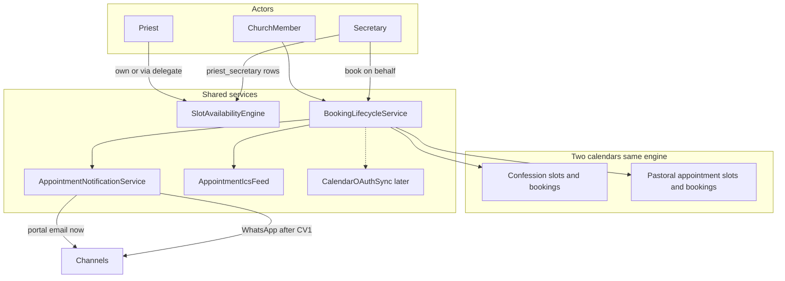

# Priest appointment calendar (Calendly-like — parked)

**Status:** Design locked. **PAC1–PAC4 landed** (schema, confession UX, pastoral types/calendar UX, portal/email lifecycle + reminder command; WhatsApp still gated on Contact Verification). **PAC5+** (ICS/OAuth) still parked until product prioritizes after T8 residual smoke-check.  
**Do not build** Blade calendar UX, notification dispatch, or ICS until the matching PAC slice kickoff.  
**Roadmap:** Post-T8 church-management enhancement (does **not** claim T9 or T10).

**Source plan:** `.cursor/plans/priest_calendar_booking_2563fdff.plan.md`  
**Parking entry:** root [`PARKING-LOT.md`](../PARKING-LOT.md) — “Priest appointment calendar (Calendly-like)”.  
**Feature-gap:** **F-21**.

---

## 1. What waits (flag explicitly)

| Work | Wait for | Why |
|------|----------|-----|
| Schema, secretary role, policies (PAC1) | Done (landed) | Backend expand shipped |
| Confession Calendly UX (PAC2) | Done (landed) | Grid, generate, book-on-behalf, reschedule |
| Pastoral appointment calendar (PAC3) | PAC1 | Parallel calendar; shared engine |
| Lifecycle notifications portal/email (PAC4) | PAC2/PAC3 | Types + dispatch |
| WhatsApp booking messages | **Contact Verification CV1+** | Verified-mobile gates (`mobile_verified_at`) |
| ICS feeds (PAC5) | PAC2 | Tokenized pastoral feeds |
| Google/Outlook OAuth push (PAC6) | PAC5 + ops OAuth apps | Later slice; not v1 |
| Two-way busy sync / public booking links | Never in this epic | Explicit non-goals |
| SMS reminders | Post-CV SMS provider | Same as Contact Verification park |
| Mobile native booking UI | Mobile matrix demand | Web first |

**Phase-safe deliverable (PAC0):** this design doc + parking-lot + feature-gap **F-21** + master-plan §9 cross-link. **No product code.**

---

## 2. Locked product choices

| Decision | Choice |
|----------|--------|
| Scope | **Two calendars:** keep **confessions** separate; add a **pastoral-appointment** calendar with meeting types |
| External calendars | **ICS subscribe in v1**; **OAuth Google/Outlook write** as PAC6 |
| Secretary | New **`secretary` role template** **and** priest **delegation** via `priest_secretary` |
| Who books | Any **approved church member** (`church_user` + registration complete); secretary may **book on behalf** |
| Privacy | Secretary **sees booker identity and notes** for delegated priests (same visibility as priest) |
| Notifications | Configurable portal / email / WhatsApp per type; **WhatsApp only after CV** |
| Rules | Confession capacity default **1**; appointment types set own capacity; reschedule = cancel + rebook same priest/kind; lead-time + cancel window; weekly availability templates |

Also locked:

- Arabic primary, RTL-first; en secondary; no npm / no frontend build step.
- Authorization = Policies + permission keys only (no role-name string checks).
- All tenant models use `BelongsToChurch`; destructive cancel / delegate remove → `audit_log`.
- Additive migrations only; do **not** merge confession tables into appointment tables in v1.

---

## 3. Product intent

Upgrade the shipped T5 confession list into a Calendly-like booking experience, and add a **second** priest calendar for pastoral appointments (counseling, meetings, etc.). Priests (and their secretaries) open/block slots; approved church members book, edit notes, cancel, and reschedule. Bookings notify priest and member on configurable channels; secretaries can reach out for reminders or rescheduling.



---

## 4. Current baseline (extend, don’t rip)

| Piece | Today |
|-------|--------|
| Tables | `priest`, `confession_slot`, `confession_booking` |
| UI | List CRUD in `ConfessionController` — no week grid, no cancel UI, no secretary, no notifications |
| Permissions | `confession.view\|manage\|book` under capability `church_management` |
| Personal `.ics` | `CalendarService` — sessions/exams/events only; **not** confessions |
| Notifications | `config/notifications.php` + `NotificationDispatchService` |

Master-plan §9 already describes priest-owned confession slots and optional booking. This epic **extends** that section; it does not replace T5.

---

## 5. Capability & permissions (Roles Hub)

Stay under existing capability **`church_management`** (no new capability). Add permission keys and a **`secretary`** role template.

### Confession (extend)

| Key | Meaning |
|-----|---------|
| `confession.view` | View confession calendar / open slots |
| `confession.manage` | Manage **own** priest slots (open/block/generate) |
| `confession.manage_delegated` | Manage slots for priests where user is an active `priest_secretary` |
| `confession.book` | Book / cancel / reschedule **self** |
| `confession.book_on_behalf` | Book / cancel / reschedule for another member |

### Pastoral appointments (new)

| Key | Meaning |
|-----|---------|
| `appointment.view` | View pastoral appointment calendar |
| `appointment.manage` | Manage **own** appointment slots |
| `appointment.manage_delegated` | Manage delegated priests’ appointment slots |
| `appointment.book` | Book / cancel / reschedule **self** |
| `appointment.book_on_behalf` | Book on behalf of a member |

### Role templates

| Template | Keys (relevant) |
|----------|-----------------|
| **`secretary`** (new) | `confession.view`, `confession.manage_delegated`, `confession.book_on_behalf`, `appointment.view`, `appointment.manage_delegated`, `appointment.book_on_behalf` |
| **priest** | existing + `appointment.view`, `appointment.manage` (own) |
| **church-admin** | full confession + appointment keys including manage / book_on_behalf |
| **servant** / default member | `confession.view`, `confession.book`, `appointment.view`, `appointment.book` |

Member booking is **not** limited to a role named “servant”: any approved church member with `*.book` may book. Grant those keys via servant template and/or default membership permissions.

Authorization checks: permission key **and** (for delegated manage) an active `priest_secretary` row for that priest. **Never** compare role name strings.

Sync via `php artisan permissions:sync`; Policies + `permission:` middleware.

---

## 6. Data model (additive, tenant-scoped)

All models use `BelongsToChurch` + stamp helpers as elsewhere. No FKs required in first expand if matching church-mgmt style; isolation tests mandatory.

### Delegation

**`priest_secretary`**

| Column | Notes |
|--------|--------|
| `priest_secretary_id` | PK |
| `church_id` | indexed |
| `priest_id` | indexed |
| `user_id` | indexed |
| `status` | `active` \| `inactive` |
| timestamps | |
| unique | `(priest_id, user_id)` |

Priest (active priest row) or church-admin with `priest.manage` assigns/removes secretaries. Audit `priest_secretary.saved` / `.removed`.

### Confession (additive columns only)

Keep `confession_slot` / `confession_booking`. Expand bookings:

| Column | Notes |
|--------|--------|
| `booked_by_user_id` | nullable; actor when book-on-behalf (else = `user_id`) |
| `rescheduled_from_booking_id` | nullable link |
| `cancelled_at` / `cancelled_by_user_id` | optional clarity beyond status |
| `member_notes` | booker-visible notes (or reuse `notes` with clear semantics) |

Slot `recurrence` column already exists — **wire UI** in PAC2 (weekly templates → generate concrete slots). Statuses remain `open` \| `closed` \| `cancelled` (closed = blocked).

### Pastoral appointments (new parallel tables)

**`appointment_type`**

| Column | Notes |
|--------|--------|
| `appointment_type_id` | PK |
| `church_id` | |
| `slug` / `name_ar` / `name_en` | e.g. pastoral-meeting |
| `default_capacity` | unsigned smallint |
| `default_duration_minutes` | |
| `status` | `active` \| `inactive` |

**`appointment_slot`** — mirror confession_slot shape (`priest_id`, `appointment_type_id`, `starts_at`, `ends_at`, `capacity`, `location`, `recurrence`, `status`, `notes`).

**`appointment_booking`** — mirror confession_booking + `booked_by_user_id`, reschedule link; unique `(appointment_slot_id, user_id)`.

### Church settings (booking rules + timezone)

Under `church.settings` (or dedicated keys):

```json
{
  "timezone": "Africa/Cairo",
  "booking": {
    "min_lead_minutes": 60,
    "cancel_cutoff_minutes": 120
  }
}
```

Times stored UTC; display in church timezone (closes master-plan §17 timezone question for this module).

---

## 7. Shared services (implementation sketch)

| Service | Responsibility |
|---------|----------------|
| `SlotAvailabilityEngine` | Generate slots from weekly templates; open/block; remaining capacity |
| `BookingLifecycleService` | Book, edit notes, cancel, reschedule (cancel old + book new, same priest/kind); enforce lead/cutoff; book-on-behalf |
| `AppointmentNotificationService` | Dispatch lifecycle + reminder types; WA no-op until CV gates |
| `AppointmentIcsFeed` | Tokenized private ICS for member / priest(+secretary) agendas |
| `CalendarOAuthSync` | PAC6 only — Google Calendar API + Microsoft Graph push |

Operate on a small interface (`BookableSlot` / `Booking`) so confession and appointment UIs share one engine.

---

## 8. Product behavior

### Priest / secretary (per calendar)

- Week/month grid of availability.
- Weekly availability templates → generate concrete slots.
- Per slot: **open / blocked (closed) / cancelled**; capacity; location; notes.
- Bookings list; cancel or help reschedule; **send reminder now** (audit).
- Secretary sees **who booked and notes** for delegated priests.

### Member

- Browse open slots for a priest (church-scoped).
- Book; edit notes; cancel; reschedule into another open slot (same priest, same calendar kind).
- “My bookings” list.

### Book-on-behalf

Secretary selects member + slot. Store `user_id` = attendee, `booked_by_user_id` = actor. Audit both. Notify attendee and priest.

### Defaults

- Confession capacity default **1**; appointment types set their own default capacity.
- Min lead time **60** minutes; cancel/reschedule cutoff **120** minutes before start (church-configurable).

---

## 9. Notifications

New category (e.g. `pastoral`) in `config/notifications.php`. Shared type names for confession + pastoral; payload includes `kind` (`confession` \| `appointment`):

| Type | When |
|------|------|
| `appointment_booking_confirmed` | Book created |
| `appointment_booking_updated` | Notes / metadata edited |
| `appointment_booking_cancelled` | Cancelled |
| `appointment_booking_rescheduled` | Reschedule completed |
| `appointment_booking_reminder` | Scheduled lead hours before start |

Recipients: **attendee** and **priest**; optionally active secretaries for the priest’s copy.

Channels from user prefs (portal / email / WhatsApp):

- **v1:** portal + email immediately.
- **WhatsApp:** register types in config now; dispatch only when CV gates exist (`mobile_verified_at` + prefs). Until CV1, WhatsApp stays off / no-op for these types.
- Reminders: artisan scheduled command (pattern like session reminders); lead hours in type `config`.

Secretary “reach out”: reuse dispatch + “send reminder now” on booking (`audit_log`).

---

## 10. Calendar integrations

### PAC5 — ICS (v1)

Tokenized private feeds (do **not** mix secrets with course `/calendar.ics`):

- Member: own upcoming confession + appointment bookings.
- Priest / delegated secretary: agenda including booker names for that priest.

Importable into Google Calendar / Outlook as subscribe/file.

### PAC6 — OAuth (later)

- Google Calendar API + Microsoft Graph.
- Encrypted tokens per user; push create/update/delete on booking lifecycle (priest; optional member).
- **No** two-way busy-block sync in this epic.

---

## 11. Implementation order (resume sequence)

Prerequisite: **T8 residual smoke-checked**. Prefer **CV1** before enabling WhatsApp for these types (email/portal can ship in PAC4 earlier). Independent of **T10**.

| Step | Slice | Delivers | Depends on |
|------|--------|----------|------------|
| **PAC0** | Docs | This design + PARKING-LOT + F-21 + §9 cross-link | Done when this file lands |
| **PAC1** | Backend expand | `priest_secretary`; additive booking columns; appointment tables; permission keys + `secretary` template; policies; isolation tests | **Landed** |
| **PAC2** | Confession UX | Grid, open/block, recurrence generate, cancel/reschedule, book-on-behalf, my-bookings | **Landed** |
| **PAC3** | Pastoral calendar | Types + same UX as PAC2 | **Landed** |
| **PAC4** | Notifications | Types + lifecycle + reminders (portal/email); WA gated on CV1 | **Landed** (WA → CV1) |
| **PAC5** | ICS | Priest/member tokenized feeds | PAC2 |
| **PAC6** | OAuth | Google/Outlook push | PAC5; ops OAuth apps |

**Next:** **PAC5** (ICS) when prioritized. WhatsApp channel for pastoral types waits on **CV1**.

---

## 12. Explicit non-goals (v1)

- Public (non-member) booking links
- Two-way Google/Outlook busy sync
- SMS (until post-CV SMS provider)
- Merging confession into appointment tables (contract later, if ever)
- Mobile native booking UI (web first; API later if mobile matrix needs it)
- Stealing roadmap slots **T9** or **T10**

---

## 13. Risks / invariants

- Confession secrecy: product choice is secretary **may** see bookers/notes — document in UI copy; audit sensitive exports if added later.
- Tenant isolation mandatory on all new tables (`BelongsToChurch` + isolation suite).
- Additive migrations only; no drop/rename of confession columns outside a future Phase-5-style contract PR.
- No npm / no frontend build — Blade + existing CSS/JS patterns.
- Money rules N/A.

---

## 14. Test expectations (when built)

- Tenant isolation for `priest_secretary`, `appointment_*`, expanded confession bookings.
- Permission + delegation matrix (own manage vs delegated vs book-on-behalf vs member self-book).
- Capacity / lead-time / cutoff enforcement; reschedule atomicity.
- Notification dispatch (portal/email); WhatsApp skipped without CV gates.
- ICS feed auth via token (no session leak across tenants).
