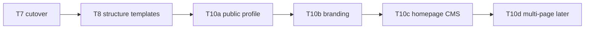

# Public Church Presence — Homepage CMS (T10 — parked)

**Status:** Design locked; **not implemented.** Staging current phase is **T8 (expand)**.  
**Do not build** migrations, routes, Blade UI, or permission catalog entries until a **T10 kickoff PR** after **T8** residual smoke-check.  
**Roadmap slot:** **T10** in [`khedma-master-plan.md`](khedma-master-plan.md) §7. (T9 is reserved for service cycle progression when that item is scheduled.)

**Source plan:** `.cursor/plans/church_homepage_cms_4247561e.plan.md`  
**Parking entry:** root [`PARKING-LOT.md`](../PARKING-LOT.md) — “Public Church Presence / Homepage CMS”.

---

## 1. What waits (flag explicitly)

| Work | Wait for | Why |
|------|----------|-----|
| Public profile fields + admin UI (T10a) | T8 residual smoke-checked | Out of phase; finish structure-template expand first |
| Branding self-service wired to chrome (T10b) | Same + overlaps parked T4 branding | Logo/palette already deferred from T4 |
| Homepage CMS schema/editor/renderer (T10c) | T10a + T10b | Editor needs profile + branding |
| Multi-page site (T10d) | T10c | Homepage-only first |
| Custom-domain TLS automation | Ops demand | Manual DNS/TLS per domain is enough for early pilots |
| DB-per-tenant (Tier 3) in same SaaS app | Enterprise program | Not built; use Tier 4 dedicated deploy if needed now |
| White-label mobile store apps (M2) | Mobile MVP M1 | Separate product track |
| Freeform page builder | Never in v1 | Explicit non-goal |

**This PR / phase-safe deliverable:** this design doc + parking-lot + master-plan T10 row + invariant tests that the design remains complete. **No product code.**

---

## 2. Locked product choices

- **Homepage-only** first; multi-page later (T10d).
- **Curated typed sections** (not a freeform drag-drop builder).
- Sequence: portal church config → public church details → homepage editor.
- Arabic primary, RTL-first; en secondary; no npm / no frontend build step.
- Authorization = Policies + permission keys only (no role-name string checks).
- All tenant models use `BelongsToChurch`; money rules N/A; destructive publish/unpublish/media delete → `audit_log`.

---

## 3. Product intent

After a church is provisioned and has filled **public details**, church admins with permission edit a **dynamic public homepage** on their tenant host (`{slug}.{base}` / custom `church.domain`): theme (colors/fonts/logo), ordered sections, images. Guests see the marketing homepage; members still use the authenticated portal.

Today `GET /` is the login form. When capability + publish gate are on, the public site **owns `/`**; login remains at `/login`.



---

## 4. Prerequisites

### T10a — Public church profile

Store under `church.settings.public` (no new table in v1 unless fields grow):

- `tagline` (ar/en), `about` (ar/en short HTML-safe markdown)
- `address`, `city`, `geo` (lat/lng optional)
- `phone`, `whatsapp`, `email`
- `social` (facebook/youtube/instagram URLs)
- `liturgy_hours` structured list (day + time label ar/en)
- `show_on_public_site` toggles per field group

Admin UI gated by `public_site.profile` (preferred) or existing `church.configure`.

### T10b — Branding self-service

Wire logo + palette into tenant chrome per [`architecture/multi-subsidiary/P5-provisioning-customization.md`](architecture/multi-subsidiary/P5-provisioning-customization.md). CMS theme **extends** this; logo is shared. (Already parked from T4.)

---

## 5. Capability & permissions (Roles Hub)

New capability in `config/capabilities.php`:

```php
'public_site' => [
    'label' => 'capabilities.public_site',
    'permissions' => [
        'public_site.profile',
        'public_site.theme',
        'public_site.manage',
        'public_site.publish',
    ],
    'config' => [],
],
```

| Key | Meaning |
|-----|---------|
| `public_site.profile` | Edit public church details |
| `public_site.theme` | Edit colors/fonts/logo used by public site |
| `public_site.manage` | Edit homepage draft sections & images |
| `public_site.publish` | Publish draft → live (`audit_log`) |

- Disabled capability → routes 404; keys not grantable (ceiling model).
- Default grant on `church-admin` role template only.
- Sync via `php artisan permissions:sync`; Policies + `permission:` middleware.

---

## 6. Data model (additive, tenant-scoped)

All models use `BelongsToChurch`. Draft vs published so live site never shows half-edits.

| Table | Role |
|-------|------|
| `church_site` | One row per church: `theme_draft`, `theme_published`, `published_at`, `published_by` |
| `church_site_section` | Typed sections: `type`, `sort_order`, `enabled_draft` / `enabled_published`, `content_draft` / `content_published` |
| `church_media` | Uploads: `path`, `alt_ar`, `alt_en`, `width`, `height` |

- Create `church_site` when capability enabled / first editor open.
- Publish copies `*_draft` → `*_published` in a transaction + audit `public_site.published`.
- Unpublish / disable capability: guests fall back to login-only `/`.

**T10d:** add `church_site_page` (`slug`, `title_*`); attach sections to `page_id`; homepage = `slug=home`. Do not build in T10c.

---

## 7. Theme system

Public site theme is **independent of** the portal light/dark cookie (`ThemeController`), but logo/name come from church branding.

**CSS variables** on `<body class="public-site">`:

| Token | Role |
|-------|------|
| `--ps-primary` / `--ps-primary-text` | Buttons, links |
| `--ps-accent` | Highlights, scripture bars |
| `--ps-bg` / `--ps-surface` | Page / section backgrounds |
| `--ps-text` / `--ps-muted` | Body / secondary |
| `--ps-hero-overlay` | Scrim over hero image |
| `--ps-font-display` / `--ps-font-body` | Font stacks |
| `--ps-radius` | sm/md/lg from allowlist |

**Constraints:**

- Hex validation; reject low-contrast primary vs primary-text.
- Font allowlist only: Cairo (default RTL), Amiri (optional display), plus one Latin-safe sans if needed. Default from [`resources/design-tokens/khoddam.tokens.json`](../resources/design-tokens/khoddam.tokens.json).
- Public site is **light-first** (no global dark mode).
- 3–4 starter palettes; admin picks then tweaks.
- Inject via Blade (same idea as course branding). **No npm.**

---

## 8. Section catalog (curated)

Blade partials: `resources/views/public-site/sections/{type}.blade.php` + matching admin forms.

| Type | Notes |
|------|-------|
| `hero` | Full-bleed image, headline, sub, CTAs; max one |
| `about` | Title, sanitized markdown body, optional image |
| `liturgy_times` | Rows or “use profile hours” |
| `clergy` | Manual cards or `pull_priests` (no private priest data) |
| `gallery` | Ordered `church_media` ids |
| `location` | Address / map link; embed HTTPS allowlist |
| `contact` | Phone/email/whatsapp; no public inbox form in v1 |
| `cta_portal` | Login + register deep links |
| `quote` | Scripture/text + citation |
| `custom_cards` | 2–6 cards (services overview) |

**Rules:** max ~12 sections; `hero` max 1; no raw HTML; reorder via `sort_order`; disable without delete.

---

## 9. Images / media

- Path: `church/{church_id}/site/...`
- jpeg/png/webp; max ~2–5 MB; store dimensions + alt_ar/alt_en
- Block delete if used in **published** content; delete → `audit_log`

---

## 10. Public rendering & URLs

| Route | Behavior |
|-------|----------|
| `GET /` | If `public_site` enabled + `published_at` → homepage; else login (today) |
| `GET /login` | Login |
| `GET /site/preview` | Draft preview (`public_site.manage`, noindex) |
| `/site/homepage/*` | Editor (`manage` / `publish`) |

Tenant resolution unchanged: `ResolveTenant` Host → church. Layout: `layouts/public-site.blade.php` — RTL-first, locale switcher, no portal nav chrome.

---

## 11. Responsiveness

`public/css/public-site.css` (plain CSS):

- Mobile-first; hero stacked on small screens; gallery 2→3 cols
- Touch targets ≥44px; `clamp` type scale for Arabic
- Breakpoints: 360 / 768 / 1024 / 1440
- First viewport: brand + one headline + one sub + CTA group + one hero image

---

## 12. Editor UX

Path: `/site/homepage` (authenticated).

1. **Theme** tab — `public_site.theme`
2. **Sections** tab — `public_site.manage`
3. **Preview** — draft iframe
4. **Publish** — `public_site.publish` + audit

All strings via `lang/{ar,en}`.

---

## 13. Security / tenancy / audit

- BelongsToChurch on all queries; media paths include `church_id`
- Sanitize markdown (allowlist tags); escape everything else
- Map embeds: HTTPS allowlist
- Isolation tests mandatory (Church A cannot touch Church B site/media)
- Feature tests: publish gate, permission 403, guest sees published only

---

## 14. Bring-your-own domain (existing church website)

**Redirect alone is not “same domain.”** End state is DNS + TLS to the platform + `church.domain`.

| Mode | Same domain? | Use when |
|------|--------------|----------|
| **A. Full DNS cutover** | Yes | Replace old site with Khedma homepage + portal |
| **B. Split hostnames** | Marketing elsewhere | Keep legacy marketing; portal on subdomain/platform |
| **C. Temporary redirect** | No | Soft launch only |
| **D. Reverse proxy path split** | Fragile | **Unsupported** in v1 |

### Cutover runbook (Mode A)

1. Provision church; set `church.domain`.
2. Preview on `{slug}.{base}` first.
3. Lower DNS TTL; A/CNAME to platform.
4. Per-domain TLS (custom domains are **not** on the `*.base` wildcard — see [`P4-subdomains-live.md`](architecture/multi-subsidiary/P4-subdomains-live.md)).
5. TrustHosts includes domain; smoke Host → `church_id`.
6. Flip DNS; verify `/` = CMS, `/login` = portal.
7. Optional leftover 301 from old host.

Sessions on custom domains do **not** share `SESSION_DOMAIN=.base`. Old site content is **not** auto-imported.

---

## 15. Data ownership (enterprise — not part of T10 CMS)

| Tier | Meaning |
|------|---------|
| **1. Shared SaaS (today)** | Shared MySQL + `church_id` isolation; platform superadmin can bypass |
| **2. Hardened shared** | Export/delete, DPA, audited break-glass — **preferred productization** |
| **3. DB-per-tenant** | Same app switches connection after `ResolveTenant` — **not built** |
| **4. Dedicated deploy** | Separate instance + `.env` DB — **usable now** for “own MySQL” |
| **5. Self-hosted** | Church runs stack; you may never see data |

### Operator Path A (Tier 4 — now)

1. Create MySQL DB + user locked to that DB.  
2. Separate app instance + `.env` (`MULTI_TENANT=false`).  
3. Migrate/seed that DB only.  
4. Point their domain at **that** instance.  
5. Per-instance backups and upgrades.

No request-time DB switch; shared admin console does not see this church.

### Operator Path B (Tier 3 — future)

Central registry stores encrypted DSN; `ResolveTenant` binds tenant connection. Requires deciding global vs per-tenant `users` first. Do not invent ad hoc in production.

---

## 16. Separate mobile app on the stores

| Approach | Recommendation |
|----------|----------------|
| **M1. Single multi-tenant app** | Default (see [`mobile/mvp.md`](mobile/mvp.md)) |
| **M2. White-label builds** | Paid add-on; same Expo codebase, per-church branding/bundleId |
| **M3. Forked apps** | Avoid |
| **M4. Dedicated stack + app** | Only with Tier 4 |

Separate store listing does **not** require a separate database.

---

## 17. Delivery slices

1. **Docs only (phase-safe — this deliverable):** parking-lot + this doc + master-plan T10 + invariant tests.
2. **T10a:** public profile settings.
3. **T10b:** branding wired to public + portal chrome.
4. **T10c:** schema + permissions + editor + public renderer + isolation tests.
5. **T10d:** multi-page expansion.

---

## 18. Explicit non-goals (v1)

- Freeform page builder / custom HTML
- Blog, SEO suite, public contact inbox
- Dark-mode public theme toggle
- npm/Vite editor SPA
- Replacing the authenticated portal UI
- Reverse-proxy path split (Mode D)
- Auto-import of existing third-party websites
- Database-per-tenant / dedicated deploy as part of T10 CMS code
- Per-church forked mobile codebases; N-app store automation
